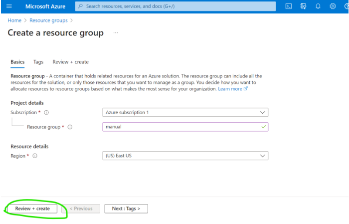
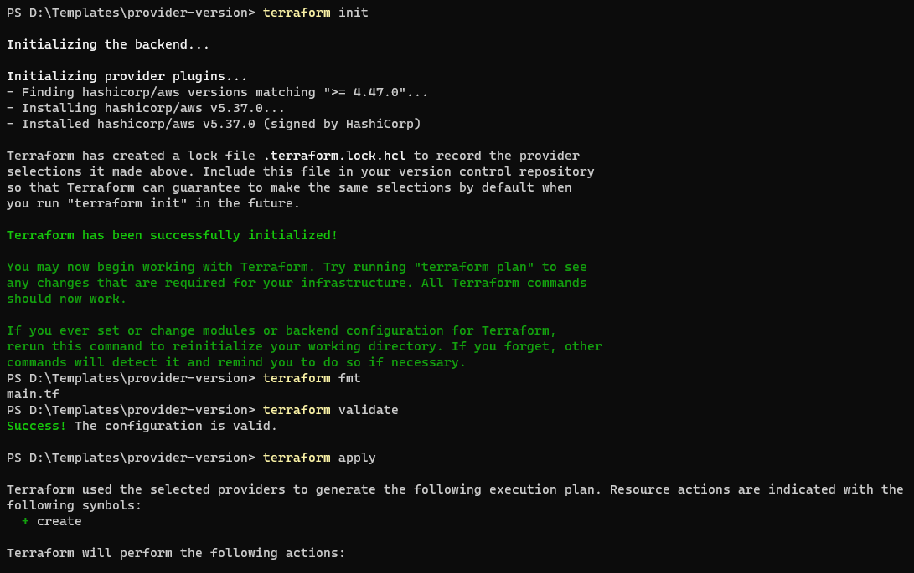
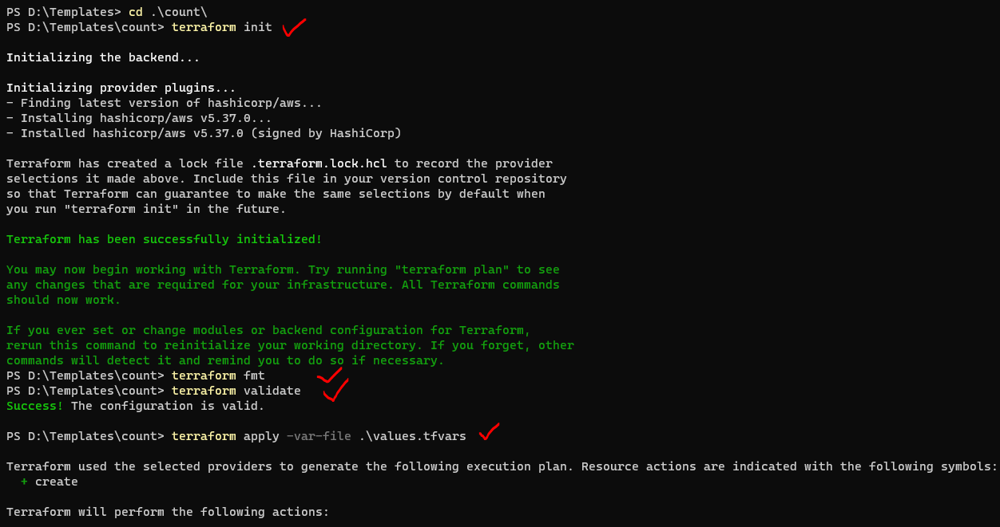
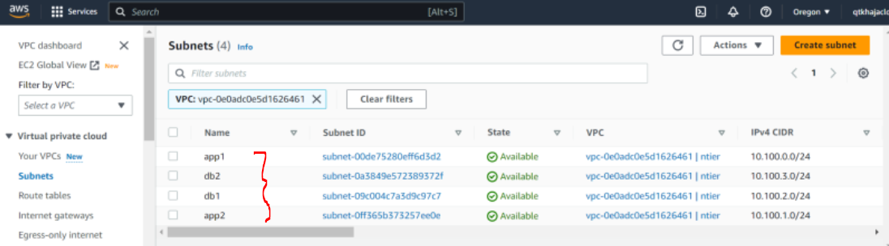
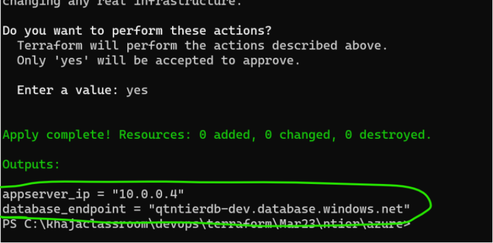
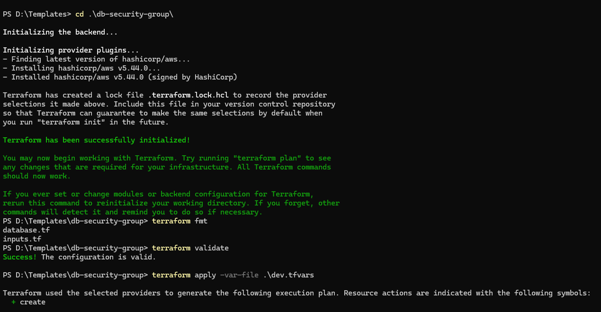
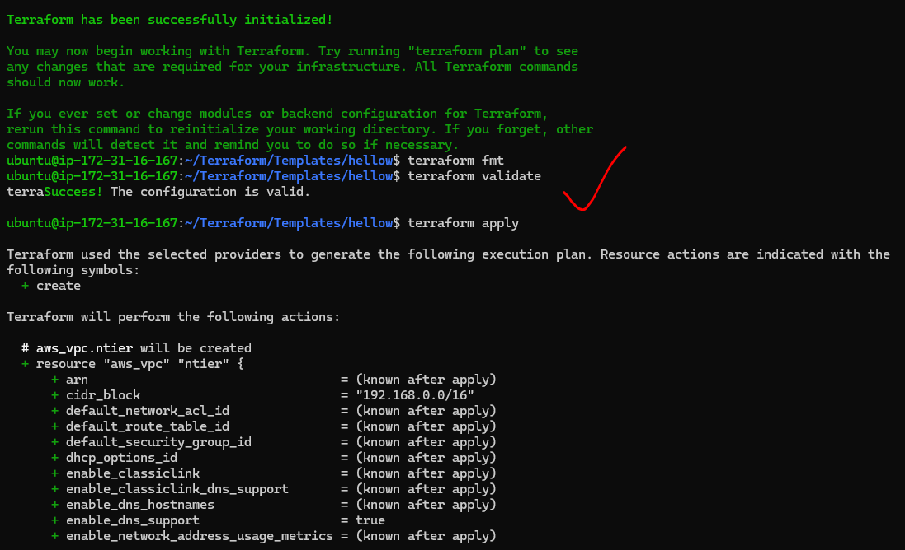
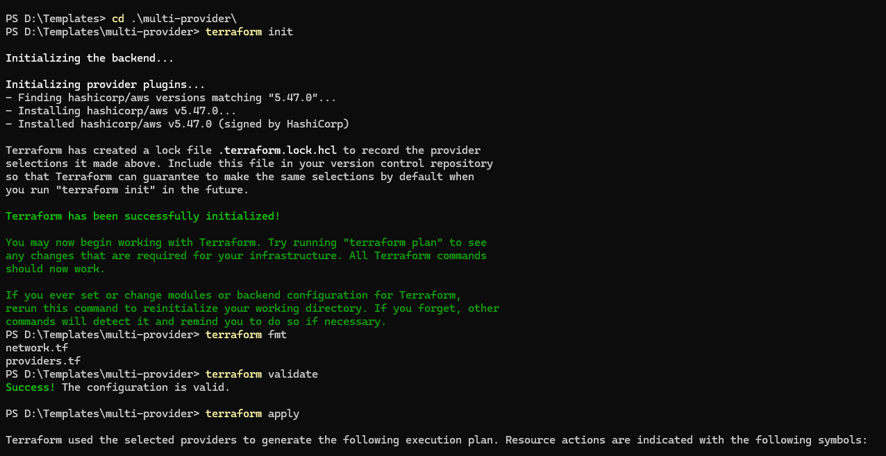

#### Problem Statement

* _**`Our ficticious Organization`**_ :
    * _**Name**_ : Asquare info systems
    * _**Product**_ : iEcommerce
    * _**Purpose**_ : Any Organization can buy this project and host ecommerce applications
* This product is designed to work on any virtualized platform such as :
    * VMWare
    * OpenStack
    * AWS
    * Azure
    * GCP
* Now `Asquare info systems` needs to have an apporach to deploy the iEcommerce application into customers _**`Cloud/Virtual Environments`**_

#### Architecture of iECommerce : 


* _**`Infra for iECommerce`**_
    * Two networks with connectivity between them ( same building, different buildings, cities, countries )
    * In Each network :
        * _**Two Databases**_ :
            * MySql
            * RAM : 8 GB
            * Cpus : 2
            * Disk : 10 TB
        * _**one File Store**_ :
            * Size : 10 TB
        * _**3 Servers**_ :
            * OS : Ubuntu - 22.04
            * RAM : 16 GB
            * Cpus : 2
            * Disk : 50 GB
* _**`Solution`**_ :
    * _**InfraProvisioning**_ : This represents using Infrastructure as a Code ( IaC ) and deploy to target environment

### Understanding InfraProvisioning

* Analogy


* We use InfraProvisioing tools where we express our desired state about `Infrastructure as code ( IaC )`
* _**Terraform**_ : Can create infra in almost all the virtual environments
* _**ARM Templates**_ : Can create infra in Azure
* _**CloudFormation**_ : Can create infra in AWS
* Infraprovisiong tools use `IaC` which are generally idempotent
* _**Idempotance**_ is the property which states execution one time or multiple times leads to the same result
* _**Reusability**_ is extremely simple and terraform can also handle multiple environments ( Developer, QA, UAT/Staging/Production )

### Terraform

* Terraform is an opensource tool developed by HashiCorp which can `create infra in almost any virtual platform`
* Terraform uses a language which is called as `Hashicorp Configuration Language (HCL)` to express desired State

#### Terms

* _**Resource**_ : The infrastructure `which you want to create`
* _**Provider**_ : To `where you want to create` the infrastructure
* _**Arguments**_ : The `inputs` which we express in terraform 
* _**Attribute**_ : The `output` given by terraform 

#### Installing terraform

* For official doc's

    [ Refer here : https://developer.hashicorp.com/terraform/install ]


#### Developer Environment

* Install Visual Studio Code
* Ensure Terraform Extension is installed


* For installing necessary softwares on your windows system

    [ Refer here : https://www.youtube.com/watch?v=9guzVbZPGuw&t=703s ]

#### Creating basic terraform template

* Create a new folder `hellotf`
* open Visual Studio Code
* Create a new file `main` with extension `.tf` - _**main.tf**_
* Choose any provider 

    [ Refer Here : https://registry.terraform.io/browse/providers?tier=official ]

* For aws provider

    [ Refer here : https://registry.terraform.io/providers/hashicorp/aws/latest ]

* Creating a template with `AWS`
```
terraform {
  required_providers {
    aws = {
      source = "hashicorp/aws"
      version = "4.58.0"
    }
  }
}

provider "aws" {
  # Configuration options
}

resource "aws_s3_bucket" "b" {
  bucket = "tf-s3-test-bucket"

  tags = {
    Name        = "My bucket"
    Environment = "Dev"
  }
}

resource "aws_s3_bucket_acl" "example" {
  bucket = aws_s3_bucket.b.id
  acl    = "private"
}
```
* We have executed the commands in following order
```
terraform apply     **
terraform init      #initialization
terraform apply     #applying the infra
yes                 #approval to create infra
terraform apply     #already existing
terraform destroy   #deleting the created infra
```


* Creating a template with `Azure`
```
terraform {
  required_providers {
    azurerm = {
      source = "hashicorp/azurerm"
      version = "3.47.0"
    }
  }
}

provider "azurerm" {
    features {}
}

resource "azurerm_resource_group" "example" {
  name     = "example-resources"
  location = "West Europe"
}

resource "azurerm_storage_account" "example" {
  name                     = "qttftestaccount"
  resource_group_name      = azurerm_resource_group.example.name
  location                 = azurerm_resource_group.example.location
  account_tier             = "Standard"
  account_replication_type = "GRS"

  tags = {
    environment = "staging"
  }
}
```


#### Basic workflow


#### N-Tier Application

* Consider the following architecture of a typical web application (ticket booking)


* To realize this application on `AWS`, the high level overview is :


* To realize this application on `Azure`, the high level overview is :


#### WOW (Ways of Working)

* Let's realize the architecture manually, make a note of :
  * resource
  * inputs
  * outputs
* Find resources in terraform to acheive the above manual steps

### Configuring a Provider in Terraform

#### Install Terraform on a linux machine

* Create a _**linux VM**_ and _**ssh**_ into it and execute the steps based on your distribution from here 

[ Refer here : https://developer.hashicorp.com/terraform/install#Linux ]


#### AWS Provider

* Terraform aws provider uses the `AWS API's` to get the infra created
* To create infrastructure in your AWS Account, it needs `AWS programatic credentials ( _**Secret access key and access key**_ )`


* To configure these keys 

  [ Refer here : https://registry.terraform.io/providers/hashicorp/aws/latest/docs#authentication-and-configuration ]

* Create `IAM user` _**Secret access key**_ and _**Access key**_ and for manual steps

  [ Refer here : https://sst.dev/chapters/create-an-iam-user.html ]

* Create `sampletf` folder and in it `main.tf`
```
mkdir sampletf
cd sampletf/
vi main.tf
```
* Let's write provider configuration in `main.tf`
```
provider "aws" {
  region     = "us-east-1"
  access_key = "my-access-key" 
  secret_key = "my-secret-key" 
}
```
* Run it using commands
```
terraform init
terraform validate
```


* This is not a great way as we are having sensitive information in the text format
* Best way is to _**install aws cli**_ on the machine with terraform and terraform will _**automatically pickup credentials**_ from there
* Installing aws cli 

  [ Refer here : https://docs.aws.amazon.com/cli/latest/userguide/getting-started-install.html ]

```
cd ~
sudo apt install unzip -y
curl "https://awscli.amazonaws.com/awscli-exe-linux-x86_64.zip" -o "awscliv2.zip"
unzip awscliv2.zip
sudo ./aws/install
aws --version
aws configure
    ## give the access key, secret key and region
```


* Create a new folder `test2`
```
mkdir test2
cd test2/
vi main.tf
```
* Now your provider can be as simple as `main.tf` and execute it with the commands
```
provider "aws" {
    region = "us-east-1"
}
```
```
terraform init
terraform validate
terraform destroy
```


### Azure Provider

* For the provider documentation

  [ Refer here : https://registry.terraform.io/providers/hashicorp/azurerm/latest/docs ]

* To install `Azure CLI` and to authenticate azure cli

  [ Refer Here : https://learn.microsoft.com/en-us/cli/azure/install-azure-cli-linux?pivots=apt#option-1-install-with-one-command ]
  
```
az login
az group list  
```
### Providers and resources

* In terraform to create any resource we need to configure provdier
* Every provider has a specific structure
```
provider "<name>" {
    <ARGUMENT-1> = <VALUE-1>
    ..
    ..
    ..
    <ARGUMENT-N> = <VALUE-N>
}
```
* The type of resource will be in the form of `<provider>_<resource_type>`

### Manual steps of VPC creation

* Steps : Let's create a simple vpc

=> Navigate to VPC => Create VPC => VPC only => IPv4 CIDR manual input => CIDR => No IPv6 CIDR block => Create VPC 


* Let's search for resource which lead to 

  [ Refer Here : https://registry.terraform.io/providers/hashicorp/aws/latest/docs/resources/vpc ]


* Now look at arguments 

  [ Refer Here : https://registry.terraform.io/providers/hashicorp/aws/latest/docs/resources/vpc#argument-reference ]

* Create the template as shown below 
```
provider "aws" {
}

resource "aws_vpc" "ntier" {
    cidr_block = "192.168.0.0/16"
    tags = {
        Name = "ntier"
    }
}
```
* Now validate and apply


### Activity : Create virtual network ( Vnet ) in Azure

* Manual steps:
  * Create resource group





  * Create a _**VNET**_ with cidr range `192.168.0.0/16`


### Writing template for the above in terraform

* Terraform takes the folder as input and reads all the `.tf` files and while validating, applying or destroying tries to treat all the `.tf` files as one file
* To _**create dependencies**_ we can use `depends_on` meta argument ( to avoid the multiple apply statements to create different resources)

  [ Refer Here : https://developer.hashicorp.com/terraform/language/meta-arguments/depends_on ]

* The resource name in terraform is `<resource_type>.<name>`
* For the changeset `main.tf`
```
resource "azurerm_resource_group" "ntierrg" {
  location = "eastus"
  name     = "ntier-rg"
}

resource "azurerm_virtual_network" "ntiervnet" {
  name                = "ntier-vnet"
  resource_group_name = "ntier-rg"
  address_space       = ["192.168.0.0/16"]
  location            = "eastus"
  depends_on = [
    azurerm_resource_group.ntierrg
  ]
}
```
* `provider.tf`
```
provider "azurerm" {
  features {}
}
```
* To execute the above
```
terraform init
terrform validate
terraform fmt
terraform apply    ## terraform apply -auto-approve
yes
terraform destroy
```


* Note : The commands which we started following `init, fmt, validate, apply`

### Focus Points

* To work effectively with terrform templates we need to understand Hashicorp Configuration Language ( HCL )
* How to parametrize the template ?

### Hashicorp Configuration Language ( HCL ) for Terraform

* _**For Specification**_ 

  [ Refer Here : https://github.com/hashicorp/hcl/blob/main/hclsyntax/spec.md ]

* _**Provider**_ 

  [ Refer Here : https://developer.hashicorp.com/terraform/language/providers ]

* The terraform block helps in configuring the provider with _**version of the provider from registry**_ 

  [ Refer Here : https://developer.hashicorp.com/terraform/language/settings ]

* To specify which version of terraform you should be using, we use `required_version`. To specify constraints :

  [ Refer Here : https://developer.hashicorp.com/terraform/language/expressions/version-constraints ]

* For changes in `provider-version` - `main.tf`
```
terraform {
  required_version = ">= 1.0.0"
  required_providers {
    aws = {
      source  = "hashicorp/aws"
      version = ">= 4.47.0"
    }
  }
}

provider "aws" {
}

resource "aws_vpc" "ntier" {
  cidr_block = "192.168.0.0/16"
  tags = {
    Name = "ntier"
  }
}
```
* To execute we use
```
terraform init
terraform fmt
terraform validate
terraform apply
terraform destroy
```


### Parametrizing Terraform

### Input Variables

* For input variables official doc's

  [ Refer here : https://developer.hashicorp.com/terraform/language/values/variables ]

* For _**inputs terraform supports**_ the following _**types**_ :
  * number
  * string
  * boolean
  * list()
  * set()
  * map()
  * object({ = , … })
  * tuple([, …])
* To _**pass variables**_ while executing commands ( dynamically ) we have two options :
  * -var
  * -var-file

1. using `-var` 

  [ Refer Here : https://developer.hashicorp.com/terraform/language/values/variables#variables-on-the-command-line ]

* For the changes to `variables` - `inputs.tf`
```
variable "region" {
  type        = string
  default     = "us-east-1"
  description = "Region to create resources"
}

variable "ntier-vpc-range" {
  type        = string
  default     = "192.168.0.0/16"
  description = "VPC Cidr Range"
}
```
* `main.tf`
```
resource "aws_vpc" "ntier" {
  cidr_block = var.ntier-vpc-range
  tags = {
    Name = "ntier"
  }
}
```
* `provider.tf`
```
terraform {
  required_version = ">= 1.0.0"
  required_providers {
    aws = {
      source  = "hashicorp/aws"
      version = ">= 4.47.0"
    }
  }
}

provider "aws" {
  region = var.region
}
```
* Execute
```
terraform init 
terraform fmt
terraform validate
terraform apply -var "region=ap-south-2" -var "ntier-vpc-range=10.10.0.0/16"
```


2. using `-var-file`

* using variable definitions 

  [ Refer Here : https://developer.hashicorp.com/terraform/language/values/variables#variable-definitions-tfvars-files ]

* add `values.tfvars`
```
region          = "us-east-1"
ntier-vpc-range = "10.100.0.0/16"
```
* Execute
```
terraform init 
terraform fmt
terraform validate
terraform apply -var-file values.tfvars
```


  
* For the changes in `azure` terraform template
`inputs.tf`
```
variable "location" {
  type        = string
  default     = "eastus"
  description = "location to create resource"
}

variable "vnet-range" {
  type        = list(string)
  default     = ["192.168.0.0/16"]
  description = "cidr range of vnet"
}
```
* `main.tf`
```
resource "azurerm_resource_group" "ntierrg" {
  location = var.location
  name     = "ntier-rg"
}

resource "azurerm_virtual_network" "ntiervnet" {
  name                = "ntier-vnet"
  resource_group_name = "ntier-rg"
  address_space       = var.vnet-range
  location            = var.location
  depends_on = [
    azurerm_resource_group.ntierrg
  ]
}
```
* `provider.tf`
```
terraform {
  required_version = ">= 1.0.0"
  required_providers {
    azurerm = {
      source  = "hashicorp/azurerm"
      version = ">= 3.48.0"
    }
  }
}

provider "azurerm" {
  features {}
}
```
* `tf.vars`
```
location   = "eastus"
vnet-range = ["10.100.0.0/16"]
```
### AWS – ntier

* Expectation


* Manual steps

=> select VPC => Subnets => Create subnet => select VPC ID => Give name, Availability zone, CIDR block


* To access outputs i.e., attributes of a resource syntax is `<resoure_type>.<name>.<atrribute-name>`
* For the changes `subnets` - `inputs.tf`
```
variable "region" {
  type        = string
  default     = "us-east-1"
  description = "Region to create resources"
}
variable "ntier-vpc-range" {
  type        = string
  default     = "192.168.0.0/16"
  description = "VPC Cidr Range"
}

variable "ntier-app1-cidr" {
  type    = string
  default = "192.168.0.0/24"
}

variable "ntier-app2-cidr" {
  type    = string
  default = "192.168.1.0/24"
}

variable "ntier-db1-cidr" {
  type    = string
  default = "192.168.2.0/24"
}

variable "ntier-db2-cidr" {
  type    = string
  default = "192.168.3.0/24"
}
```
* `main.tf`
```
resource "aws_vpc" "ntier" {
  cidr_block = var.ntier-vpc-range
  tags = {
    Name = "ntier"
  }
}

resource "aws_subnet" "app1" {
  cidr_block        = var.ntier-app1-cidr
  availability_zone = "${var.region}a"
  vpc_id            = aws_vpc.ntier.id #implicit dependency
  tags = {
    Name = "app1"
  }
  depends_on = [
    aws_vpc.ntier
  ]
}

resource "aws_subnet" "app2" {
  cidr_block        = var.ntier-app2-cidr
  availability_zone = "${var.region}b"
  vpc_id            = aws_vpc.ntier.id #implicit dependency
  tags = {
    Name = "app2"
  }
  depends_on = [
    aws_vpc.ntier
  ]
}

resource "aws_subnet" "db1" {
  cidr_block        = var.ntier-db1-cidr
  availability_zone = "${var.region}a"
  vpc_id            = aws_vpc.ntier.id #implicit dependency
  tags = {
    Name = "db1"
  }
  depends_on = [
    aws_vpc.ntier
  ]
}

resource "aws_subnet" "db2" {
  cidr_block        = var.ntier-db2-cidr
  availability_zone = "${var.region}b"
  vpc_id            = aws_vpc.ntier.id #implicit dependency
  tags = {
    Name = "db2"
  }
  depends_on = [
    aws_vpc.ntier
  ]
}
```
* `values.tfvars`
```
region          = "us-east-1"
ntier-vpc-range = "10.100.0.0/16"
ntier-app1-cidr = "10.100.0.0/24"
ntier-app2-cidr = "10.100.1.0/24"
ntier-db1-cidr  = "10.100.2.0/24"
ntier-db2-cidr  = "10.100.3.0/24"
```
* Execute 
```
terraform init
terraform fmt
terraform validate
terraform apply -var-file .\values.tfvars
```


#### Creating multiple resources 

  [ Refer Here : https://developer.hashicorp.com/terraform/language/meta-arguments/count ]

* Let's apply the _**count**_ for subnet creation, for changes _**count**_ => `inputs.tf`
```
variable "region" {
  type        = string
  default     = "us-east-1"
  description = "Region to create resources"
}

variable "ntier-vpc-range" {
  type        = string
  default     = "192.168.0.0/16"
  description = "VPC Cidr Range"
}

variable "ntier-subnet-cidrs" {
  type    = list(string)
  default = ["192.168.0.0/24", "192.168.1.0/24", "192.168.2.0/24", "192.168.3.0/24"]
}

variable "ntier-subnet-azs" {
  type    = list(string)
  default = ["a", "b", "a", "b"]
}

variable "ntier-subnet-names" {
  type    = list(string)
  default = ["app1", "app2", "db1", "db2"]
}
```
* `main.tf`
```
resource "aws_vpc" "ntier" {
  cidr_block = var.ntier-vpc-range
  tags = {
    Name = "ntier"
  }
}

resource "aws_subnet" "subnets" {
  count             = 4
  cidr_block        = var.ntier-subnet-cidrs[count.index]
  availability_zone = "${var.region}${var.ntier-subnet-azs[count.index]}"
  vpc_id            = aws_vpc.ntier.id #implicit dependency
  depends_on = [
    aws_vpc.ntier
  ]
  tags = {
    Name = var.ntier-subnet-names[count.index]
  }
}
```
* `values.tfvars`
```
region             = "us-east-1"
ntier-vpc-range    = "10.100.0.0/16"
ntier-subnet-cidrs = ["10.100.0.0/24", "10.100.1.0/24", "10.100.2.0/24", "10.100.3.0/24"]
```
* Execute
```
terraform init
terraform fmt
terraform validate
terraform apply -var-file .\values.tfvars
```




* Let's start using _**terraform functions**_ to make further improvements  

  [ Refer Here : https://developer.hashicorp.com/terraform/language/functions ]

* Let's replace static `count of 4` with `length function` 

  [ Refer Here : https://developer.hashicorp.com/terraform/language/functions/length ]

* add `main.tf`
```
resource "aws_vpc" "ntier" {
  cidr_block = var.ntier-vpc-range
  tags = {
    Name = "ntier"
  }
}

resource "aws_subnet" "subnets" {
  count             = length(var.ntier-subnet-cidrs)
  cidr_block        = var.ntier-subnet-cidrs[count.index]
  availability_zone = "${var.region}${var.ntier-subnet-azs[count.index]}"
  vpc_id            = aws_vpc.ntier.id #implicit dependency
  depends_on = [
    aws_vpc.ntier
  ]
  tags = {
    Name = var.ntier-subnet-names[count.index]
  }
}
```
* Execute
```
terraform init
terraform fmt
terraform validate
terraform apply -var-file .\values.tfvars
```


### AWS

* Let's generate subnet CIDR range


* For the changes done to use `CIDR subnet` function and object input type _**subnets-range**_ => `inputs.tf`
```
variable "region" {
  type        = string
  default     = "us-east-1"
  description = "Region to create resources"
}

variable "ntier_vpc_info" {
  type = object({
    vpc_cidr     = string,
    subnet_azs   = list(string),
    subnet_names = list(string)
  })
  default = {
    subnet_azs   = ["a", "b", "a", "b"]
    subnet_names = ["app1", "app2", "db1", "db2"]
    vpc_cidr     = "192.168.0.0/16"
  }
}
```
  * `main.tf`
```
resource "aws_vpc" "ntier" {
  tags = {
    Name = "ntier"
  }
}

resource "aws_subnet" "subnets" {
  count             = length(var.ntier_vpc_info.subnet_names)
  cidr_block        = cidrsubnet(var.ntier_vpc_info.vpc_cidr, 8, count.index)
  availability_zone = "${var.region}${var.ntier_vpc_info.subnet_azs[count.index]}"
  vpc_id            = aws_vpc.ntier.id #implicit dependency
  depends_on = [
    aws_vpc.ntier
  ]
  tags = {
    Name = var.ntier_vpc_info.subnet_names[count.index]
  }
}
```
  * `values.tfvars`
```
region = "us-east-1"
ntier_vpc_info = {
  subnet_azs   = ["a", "b", "a", "b", "a", "b"]
  subnet_names = ["app1", "app2", "db1", "db2", "web1", "web2"]
  vpc_cidr     = "192.168.0.0/16"
}
```


* Terraform plan is generated whenever we apply

### Azure

* Let's add subnets, refer below for manual steps
* For the changes `.terraform.tfstate.lock.info`
```
{"ID":"369b9c9c-99ce-574e-b2dc-248e60926f4e","Operation":"OperationTypeApply","Info":"","Who":"DESKTOP-TM7SH71\\Dell@DESKTOP-TM7SH71","Version":"1.3.9","Created":"2023-03-23T03:39:17.249786Z","Path":"terraform.tfstate"}
```
* `inputs.tf`
```
variable "location" {
  type        = string
  default     = "eastus"
  description = "location to create resource"
}
variable "vnet-range" {
  type        = list(string)
  default     = ["192.168.0.0/16"]
  description = "cidr range of vnet"
}

variable "subnet_names" {
  type    = list(string)
  default = ["web", "app", "db"]
}
```
* `main.tf`
```
resource "azurerm_resource_group" "ntierrg" {
  location = var.location
  name     = "ntier-rg"
}
resource "azurerm_virtual_network" "ntiervnet" {
  name                = "ntier-vnet"
  resource_group_name = "ntier-rg"
  address_space       = var.vnet-range
  location            = var.location
  depends_on = [
    azurerm_resource_group.ntierrg
  ]
}

resource "azurerm_subnet" "subnets" {
  count                = length(var.subnet_names)
  name                 = var.subnet_names[count.index]
  resource_group_name  = azurerm_resource_group.ntierrg.name
  virtual_network_name = azurerm_virtual_network.ntiervnet.name
  address_prefixes     = [cidrsubnet(var.vnet-range[0], 8, count.index)]
  depends_on = [
    azurerm_virtual_network.ntiervnet
  ]
}
```
### Azure - ntier

* We need to create the following network


* replaced hardcode names for resource group and vnet with variable 
* For the changes `dev.tfvars`
```
location     = "eastus"
vnet_range   = ["10.0.0.0/16"]
subnet_names = ["app", "db"]
```
* `inputs.tf`
```
variable "location" {
  type        = string
  default     = "eastus"
  description = "location to create resource"
}

variable "vnet_range" {
  type        = list(string)
  default     = ["192.168.0.0/16"]
  description = "cidr range of vnet"
}
variable "subnet_names" {
  type    = list(string)
  default = ["web", "app", "db"]
}

variable "names" {
  type = object({
    resource_group = string
    vnet           = string
  })
  default = {
    resource_group = "ntier-rg"
    vnet           = "ntier-vnet"
  }
}
```
* `main.tf`
```
resource "azurerm_resource_group" "ntierrg" {
  location = var.location
    name     = var.names.resource_group
  tags = {
    Env       = "Dev"
    CreatedBy = "Terraform"
  }
}

resource "azurerm_virtual_network" "ntiervnet" {
    name                = var.names.vnet
  resource_group_name = azurerm_resource_group.ntierrg.name
  address_space       = var.vnet_range
  location            = var.location
  depends_on = [
    azurerm_resource_group.ntierrg
  ]
    tags = {
    Env       = "Dev"
    CreatedBy = "Terraform"
  }
}

resource "azurerm_subnet" "subnets" {
  count                = length(var.subnet_names)
  name                 = var.subnet_names[count.index]
  resource_group_name  = azurerm_resource_group.ntierrg.name
  virtual_network_name = azurerm_virtual_network.ntiervnet.name
    address_prefixes     = [cidrsubnet(var.vnet_range[0], 8, count.index)]
  depends_on = [
    azurerm_virtual_network.ntiervnet
  ]
}
```
### Let's try to create SQL Database in Azure

* Manual steps : 

  [ Refer Here : https://learn.microsoft.com/en-us/azure/azure-sql/database/single-database-create-quickstart?view=azuresql&tabs=azure-portal ]

* We need to create SQL Server and then database
* For the changes to create sql server
* `database.tf`
```
resource "azurerm_mssql_server" "sql_server" {
  name                         = var.names.sql_server
  resource_group_name          = azurerm_resource_group.ntierrg.name
  location                     = azurerm_resource_group.ntierrg.location
  version                      = "12.0"
  administrator_login          = "devops"
  administrator_login_password = "ThisPasswordisnotgreat@1"
  tags = {
    Env       = "Dev"
    CreatedBy = "Terraform"
  }
}
```
* `inputs.tf`
```
variable "location" {
  type        = string
  default     = "eastus"
  description = "location to create resource"
}
variable "vnet_range" {
  type        = list(string)
  default     = ["192.168.0.0/16"]
  description = "cidr range of vnet"
}
variable "subnet_names" {
  type    = list(string)
  default = ["web", "app", "db"]
}
variable "names" {
  type = object({
    resource_group = string
    vnet           = string
    sql_server     = string
  })
  default = {
    resource_group = "ntier-rg"
    vnet           = "ntier-vnet"
    sql_server     = "qtntierdb-dev"
  }
}
```
* Execution and Database creation are pending

### Terms

* _**Configuration Drift**_ :
    * Difference between actual and desired state
    * In `Terraform plan` represents drift

### Creating database in Azure using Terraform

* We have added the resource to create sql server on azure and applied the template For the changes 
* `database.tf`
```
resource "azurerm_mssql_server" "sql_server" {
  name                         = var.names.sql_server
  resource_group_name          = azurerm_resource_group.ntierrg.name
  location                     = azurerm_resource_group.ntierrg.location
  version                      = "12.0"
  administrator_login          = "devops"
  administrator_login_password = "ThisPasswordisnotgreat@1"
  tags = {
    Env       = "Dev"
    CreatedBy = "Terraform"
  }
  depends_on = [
    azurerm_resource_group.ntierrg,
    azurerm_virtual_network.ntiervnet
  ]
}

resource "azurerm_mssql_database" "sql_emp_db" {
  name      = "employees"
  server_id = azurerm_mssql_server.sql_server.id
  sku_name  = "Basic"
  tags = {
    Env       = "Dev"
    CreatedBy = "Terraform"
  }

  depends_on = [
    azurerm_mssql_server.sql_server
  ]
}
```


* Terraform graph command creates dependency graphs in dot format which can be visualized in Graphviz. For the command

  [ Refer here : https://developer.hashicorp.com/terraform/cli/commands/graph ]


### Create VM's in Azure using Terraform

* Overview of our goal


* For manual steps

  [ Refer here : https://learn.microsoft.com/en-us/azure/virtual-machines/linux/quick-create-portal?tabs=ubuntu ]

* For changes `app.tf`
```
resource "azurerm_network_interface" "appserver_nic" {
  name                = "appservernic"
  location            = azurerm_resource_group.ntierrg.location
  resource_group_name = azurerm_resource_group.ntierrg.name

  ip_configuration {
    name      = "appserverip"
    subnet_id = azurerm_subnet.subnets[var.appsubnet_index].id
    private_ip_address_allocation = "Dynamic"
  }

  depends_on = [
    azurerm_subnet.subnets
  ]
}

resource "azurerm_linux_virtual_machine" "appserver" {
  name                = "appserver1"
  location            = azurerm_resource_group.ntierrg.location
  resource_group_name = azurerm_resource_group.ntierrg.name
  admin_username      = "qtdevops"
  admin_password      = "ThisPasswordisnotgreat@1"
  disable_password_authentication = false
  source_image_reference {
    publisher = "Canonical"
    offer     = "0001-com-ubuntu-server-focal"
    sku       = "20_04-lts-gen2"
    version   = "latest"
  }
  size = "Standard_B1s"
  network_interface_ids = [
    azurerm_network_interface.appserver_nic.id
  ]
  os_disk {
    caching              = "ReadWrite"
    storage_account_type = "Standard_LRS"
  }

  depends_on = [
    azurerm_network_interface.appserver_nic
  ]
}
```
* `database.tf`
```
resource "azurerm_mssql_server" "sql_server" {
  name                         = var.names.sql_server
  resource_group_name          = azurerm_resource_group.ntierrg.name
  location                     = azurerm_resource_group.ntierrg.location
  version                      = "12.0"
  administrator_login          = "devops"
  administrator_login_password = "ThisPasswordisnotgreat@1"
  tags = {
    Env       = "Dev"
    CreatedBy = "Terraform"
  }
  depends_on = [
    azurerm_resource_group.ntierrg,
    azurerm_virtual_network.ntiervnet,
    azurerm_subnet.subnets
  ]
}

resource "azurerm_mssql_database" "sql_emp_db" {
  name      = "employees"
  server_id = azurerm_mssql_server.sql_server.id
  sku_name  = "Basic"
  tags = {
    Env       = "Dev"
    CreatedBy = "Terraform"
  }
  depends_on = [
    azurerm_mssql_server.sql_server
  ]
}
```
* `dev.tfvars`
```
location        = "eastus"
vnet_range      = ["10.0.0.0/16"]
subnet_names    = ["app", "db"]
appsubnet_index = 0
```
* `inputs.tf`
```
variable "location" {
  type        = string
  default     = "eastus"
  description = "location to create resource"
}
variable "vnet_range" {
  type        = list(string)
  default     = ["192.168.0.0/16"]
  description = "cidr range of vnet"
}
variable "subnet_names" {
  type    = list(string)
  default = ["web", "app", "db"]
}
variable "names" {
  type = object({
    resource_group = string
    vnet           = string
    sql_server     = string
  })
  default = {
    resource_group = "ntier-rg"
    vnet           = "ntier-vnet"
    sql_server     = "qtntierdb-dev"
  }
}

variable "appsubnet_index" {
  type    = number
  default = 1
}
```


* We have created a VM without public ip and database connectivity between VM and SQL is using internet.
* Improvements:
  * Try to parametrize using variables and avoid creating too many variables by using object structure. For changes

* `app.tf`
```
resource "azurerm_network_interface" "appserver_nic" {
  name                = var.network_interface_info.name
  location            = azurerm_resource_group.ntierrg.location
  resource_group_name = azurerm_resource_group.ntierrg.name

  ip_configuration {
    name                          = var.network_interface_info.ip_name
    subnet_id                     = azurerm_subnet.subnets[var.network_interface_info.subnet_index].id
    private_ip_address_allocation = var.network_interface_info.ip_allocation_method
  }

  depends_on = [
    azurerm_subnet.subnets
  ]
}

resource "azurerm_linux_virtual_machine" "appserver" {
  name                            = var.vm_info.name
  location                        = azurerm_resource_group.ntierrg.location
  resource_group_name             = azurerm_resource_group.ntierrg.name
  admin_username                  = var.vm_info.username
  admin_password                  = var.vm_info.password
  disable_password_authentication = false
  source_image_reference {
    publisher = "Canonical"
    offer     = "0001-com-ubuntu-server-focal"
    sku       = "20_04-lts-gen2"
    version   = "latest"
  }
  size = var.vm_info.size
  network_interface_ids = [
    azurerm_network_interface.appserver_nic.id
  ]
  os_disk {
    caching              = "ReadWrite"
    storage_account_type = "Standard_LRS"
  }
  depends_on = [
    azurerm_network_interface.appserver_nic
  ]
}
```
* `database.tf`
```
resource "azurerm_mssql_server" "sql_server" {
  name                         = var.names.sql_server
  resource_group_name          = azurerm_resource_group.ntierrg.name
  location                     = azurerm_resource_group.ntierrg.location
  version                      = var.server_info.version
  administrator_login          = var.server_info.username
  administrator_login_password = var.server_info.password
  tags = {
    Env       = "Dev"
    CreatedBy = "Terraform"
  }
  depends_on = [
    azurerm_resource_group.ntierrg,
    azurerm_virtual_network.ntiervnet,
    azurerm_subnet.subnets
  ]
}

resource "azurerm_mssql_database" "sql_emp_db" {
  name      = var.database_info.name
  server_id = azurerm_mssql_server.sql_server.id
  sku_name  = var.database_info.sku
  tags = {
    Env       = "Dev"
    CreatedBy = "Terraform"
  }
  depends_on = [
    azurerm_mssql_server.sql_server
  ]
}
``` 
* `dev.tfvars`
```
location     = "eastus"
vnet_range   = ["10.0.0.0/16"]
subnet_names = ["app", "db"]
network_interface_info = {
  ip_allocation_method = "Dynamic"
  ip_name              = "appserverip"
  name                 = "appservernic"
  subnet_index         = 0
}
```
* `inputs.tf`
```
variable "location" {
  type        = string
  default     = "eastus"
  description = "location to create resource"
}
variable "vnet_range" {
  type        = list(string)
  default     = ["192.168.0.0/16"]
  description = "cidr range of vnet"
}
variable "subnet_names" {
  type    = list(string)
  default = ["web", "app", "db"]
}
variable "names" {
  type = object({
    resource_group = string
    vnet           = string
    sql_server     = string
  })
  default = {
    resource_group = "ntier-rg"
    vnet           = "ntier-vnet"
    sql_server     = "qtntierdb-dev"
  }
}
variable "server_info" {
  type = object({
    version  = string
    username = string
    password = string
  })
  default = {
    password = "ThisPasswordisnotgreat@1"
    username = "devops"
    version  = "12.0"
  }
}

variable "database_info" {
  type = object({
    name = string
    sku  = string
  })
  default = {
    name = "employees"
    sku  = "Basic"
  }
}

variable "network_interface_info" {
  type = object({
    name                 = string
    ip_name              = string
    subnet_index         = number
    ip_allocation_method = string
  })
  default = {
    ip_allocation_method = "Dynamic"
    ip_name              = "appserverip"
    name                 = "appservernic"
    subnet_index         = 1
  }
}

variable "vm_info" {
  type = object({
    name     = string
    username = string
    password = string
    size     = string
  })
  default = {
    name     = "appserver1"
    password = "ThisPasswordisnotgreat@1"
    size     = "Standard_B1s"
    username = "qtdevops"
  }
}
```
### Terraform DataSources

* Till now we have used terraform to create resources in provider 
* Terraform can also query the provider for various information
* For official doc's

  [ Refer here : https://developer.hashicorp.com/terraform/language/data-sources ]

### Terraform outputs

* Terraform output is result which would be shown in the `stdout`
* For official doc's

  [ Refer her : https://developer.hashicorp.com/terraform/language/values/outputs ]
* Let's display private ip address and database endpoint as outputs, for the changes 
* `outputs.tf`
```
output "appserver_ip" {
  value = azurerm_linux_virtual_machine.appserver.private_ip_address
}

output "database_endpoint" {
  value = azurerm_mssql_server.sql_server.fully_qualified_domain_name
}
```



### AWS - ntier

#### Making subnets public and private

* Overview


* Creating internet-gateway and attach to vpc. For resource

  [ Refer here : https://registry.terraform.io/providers/hashicorp/aws/latest/docs/resources/internet_gateway ]

* For the changes _**internet-gateway**_ => `provider.tf`
```
terraform {
  required_version = ">= 1.0.0"
  required_providers {
    aws = {
      source  = "hashicorp/aws"
      version = ">= 4.47.0"
    }
  }
}

provider "aws" {
  region = var.region
}
```
* `inputs.tf`
```
variable "region" {
  type        = string
  default     = "us-east-1"
  description = "Region to create resources"
}

variable "ntier_vpc_info" {
  type = object({
    vpc_cidr     = string,
    subnet_azs   = list(string),
    subnet_names = list(string)
  })
  default = {
    subnet_azs   = ["a", "b", "a", "b"]
    subnet_names = ["app1", "app2", "db1", "db2"]
    vpc_cidr     = "192.168.0.0/16"
  }
}
```
* `dev.tfvars`
```
region = "us-east-1"
ntier_vpc_info = {
  subnet_azs   = ["a", "b", "a", "b", "a", "b"]
  subnet_names = ["app1", "app2", "db1", "db2", "web1", "web2"]
  vpc_cidr     = "192.168.0.0/16"
}
```
* `network.tf`
```
resource "aws_vpc" "ntier" {
  cidr_block = var.ntier_vpc_info.vpc_cidr
  tags = {
    Name = "ntier"
  }
}
resource "aws_subnet" "subnets" {
  count             = length(var.ntier_vpc_info.subnet_names)
  cidr_block        = cidrsubnet(var.ntier_vpc_info.vpc_cidr, 8, count.index)
  availability_zone = "${var.region}${var.ntier_vpc_info.subnet_azs[count.index]}"
  vpc_id            = aws_vpc.ntier.id #implicit dependency
  depends_on = [
    aws_vpc.ntier
  ]
  tags = {
    Name = var.ntier_vpc_info.subnet_names[count.index]
  }
}

resource "aws_internet_gateway" "ntier_igw" {
  vpc_id = aws_vpc.ntier.id
  tags = {
    Name = "ntier-igw"
  }
}
```
* Execute
```
terraform init
terraform fmt
terraform validate
terraform apply -var-file .\dev.tfvars
```


### Creating Route tables

* So far we have created vpc with `6 subnets` and attached `internet-gateway`
* Now let's create two route tables public and private
* Terraform has local's where we can define the value for usage within template 

  [ Refer Here : https://developer.hashicorp.com/terraform/language/values/locals ]

* For the changeset add  _**route-tables**_ => `localvalues.tf`
```
locals {
  vpc_id   = aws_vpc.ntier.id
  anywhere = "0.0.0.0/0"
}
```
* `network.tf`
```
resource "aws_vpc" "ntier" {
  cidr_block = var.ntier_vpc_info.vpc_cidr
  tags = {
    Name = "ntier"
  }
}

resource "aws_subnet" "subnets" {
  count             = length(var.ntier_vpc_info.subnet_names)
  cidr_block        = cidrsubnet(var.ntier_vpc_info.vpc_cidr, 8, count.index)
  availability_zone = "${var.region}${var.ntier_vpc_info.subnet_azs[count.index]}"
  vpc_id            = local.vpc_id
  depends_on = [
    aws_vpc.ntier
  ]
  tags = {
    Name = var.ntier_vpc_info.subnet_names[count.index]
  }
}

resource "aws_internet_gateway" "ntier_igw" {
  vpc_id = local.vpc_id
  tags = {
    Name = "ntier-igw"
  }
  depends_on = [
    aws_vpc.ntier
  ]
}

resource "aws_route_table" "private" {
  vpc_id = local.vpc_id
  tags = {
    Name = "private"
  }
  depends_on = [
    aws_subnet.subnets
  ]
}

resource "aws_route_table" "public" {
  vpc_id = local.vpc_id
  tags = {
    Name = "public"
  }
  route {
    cidr_block = local.anywhere
    gateway_id = aws_internet_gateway.ntier_igw.id
  }
  depends_on = [
    aws_subnet.subnets
  ]
}
```
* Execute
```
terraform init
terraform fmt
terraform validate
terraform apply -var-file .\dev.tfvars
```


* For route table resource reference

  [ Refer here : https://registry.terraform.io/providers/hashicorp/aws/latest/docs/resources/route_table#argument-reference ]

* Now we need to associate `private-route-table` with `4 subnets` and `public-route-table` with `2 subnets`. For the changes add _**routetable-subets**_ => `dev.tfvars`
```
region = "us-east-1"
ntier_vpc_info = {
  subnet_azs      = ["a", "b", "a", "b", "a", "b"]
  subnet_names    = ["app1", "app2", "db1", "db2", "web1", "web2"]
  vpc_cidr        = "192.168.0.0/16"
  public_subnets  = ["web1", "web2"]
  private_subnets = ["app1", "app2", "db1", "db2"]
}
```
* `inputs.tf`
```
variable "region" {
  type        = string
  default     = "us-east-1"
  description = "Region to create resources"
}

variable "ntier_vpc_info" {
  type = object({
    vpc_cidr        = string,
    subnet_azs      = list(string),
    subnet_names    = list(string),
    private_subnets = list(string),
    public_subnets  = list(string)
  })
  default = {
     subnet_azs      = ["a", "b", "a", "b"]
    subnet_names    = ["app1", "app2", "db1", "db2"]
    vpc_cidr        = "192.168.0.0/16"
    public_subnets  = []
    private_subnets = ["app1", "app2", "db1", "db2"]
  }
}
```
* `network.tf`
```
resource "aws_vpc" "ntier" {
  cidr_block = var.ntier_vpc_info.vpc_cidr
  tags = {
    Name = "ntier"
  }
}

resource "aws_subnet" "subnets" {
  count             = length(var.ntier_vpc_info.subnet_names)
  cidr_block        = cidrsubnet(var.ntier_vpc_info.vpc_cidr, 8, count.index)
  availability_zone = "${var.region}${var.ntier_vpc_info.subnet_azs[count.index]}"
  vpc_id            = local.vpc_id
  depends_on = [
    aws_vpc.ntier
  ]
  tags = {
    Name = var.ntier_vpc_info.subnet_names[count.index]
  }
}

resource "aws_internet_gateway" "ntier_igw" {
  vpc_id = local.vpc_id
  tags = {
    Name = "ntier-igw"
  }
  depends_on = [
    aws_vpc.ntier
  ]
}

resource "aws_route_table" "private" {
  vpc_id = local.vpc_id
  tags = {
    Name = "private"
  }
  depends_on = [
    aws_subnet.subnets
  ]
}

resource "aws_route_table" "public" {
  vpc_id = local.vpc_id
  tags = {
    Name = "public"
  }
  route {
    cidr_block = local.anywhere
    gateway_id = aws_internet_gateway.ntier_igw.id
  }
  depends_on = [
    aws_subnet.subnets
  ]
}

data "aws_subnets" "public" {
  filter {
    name   = "tag:Name"
    values = var.ntier_vpc_info.public_subnets
  }
  filter {
    name   = "vpc-id"
    values = [local.vpc_id]
  }
  depends_on = [
    aws_subnet.subnets
  ]
}

data "aws_subnets" "private" {
  filter {
    name   = "tag:Name"
    values = var.ntier_vpc_info.private_subnets
  }
  filter {
    name   = "vpc-id"
    values = [local.vpc_id]
  }
  depends_on = [
    aws_subnet.subnets
  ]
}

resource "aws_route_table_association" "public_associations" {
  count          = length(data.aws_subnets.public.ids)
  route_table_id = aws_route_table.public.id
  subnet_id      = data.aws_subnets.public.ids[count.index]
}

resource "aws_route_table_association" "private_associations" {
  count          = length(data.aws_subnets.private.ids)
  route_table_id = aws_route_table.private.id
  subnet_id      = data.aws_subnets.private.ids[count.index]
}
```
* Execute
```
terraform init
terraform fmt
terraform validate
terraform apply -var-file .\dev.tfvars
```


### Creating RDS DB Instance (db)

* Manual steps :
  * _**DB Subnet Group**_ : This is more than one subnet where the database has to be created
  * _**Security Group**_ :
    * mysql : open 3306 port within vpc
  * _**Database Engine**_ : mysql
  * _**Size**_ : db.t2.micro
  * _**Credentials**_ : username and password

* Creating 6 security Group, for changes _**db-security-group**_ => `database.tf`
```
resource "aws_security_group" "db" {
  name = "mysql"
  ingress {
    from_port   = local.mysql_port
    to_port     = local.mysql_port
    cidr_blocks = [var.ntier_vpc_info.vpc_cidr]
    protocol    = local.tcp
}
  tags = {
    Name = "mysql"
  }
  vpc_id = local.vpc_id
  depends_on = [
    aws_subnet.subnets
  ]
}
```
* `localvalues.tf`
```
locals {
  vpc_id     = aws_vpc.ntier.id
  anywhere   = "0.0.0.0/0"
  mysql_port = 3306
  tcp        = "tcp"
}
```
* Execute
```
terraform init
terraform fmt
terraform validate
terraform apply -var-file .\dev.tfvars
```


* Add db subnet group, for changes _**db-subnetgroup**_ => `database tf`
```
resource "aws_security_group" "db" {
  name = "mysql"
  ingress {
    from_port   = local.mysql_port
    to_port     = local.mysql_port
    cidr_blocks = [var.ntier_vpc_info.vpc_cidr]
    protocol    = local.tcp
  }
  tags = {
    Name = "mysql"
  }
  vpc_id = local.vpc_id
  depends_on = [
    aws_subnet.subnets
  ]
}

data "aws_subnets" "db" {
  filter {
    name   = "tag:Name"
    values = var.ntier_vpc_info.db_subnets
  }
  filter {
    name   = "vpc-id"
    values = [local.vpc_id]
  }
  depends_on = [
    aws_subnet.subnets
  ]
}

resource "aws_db_subnet_group" "ntier" {
  name       = "ntier"
  subnet_ids = data.aws_subnets.db.ids
  depends_on = [
    aws_subnet.subnets
  ]
}
```
* `dev.tfvars`
```
region = "us-east-1"
ntier_vpc_info = {
  subnet_azs      = ["a", "b", "a", "b", "a", "b"]
  subnet_names    = ["app1", "app2", "db1", "db2", "web1", "web2"]
  vpc_cidr        = "192.168.0.0/16"
  public_subnets  = ["web1", "web2"]
  private_subnets = ["app1", "app2", "db1", "db2"]
  db_subnets      = ["db1", "db2"]
}
```
* `inputs.tf`
```
variable "region" {
  type        = string
  default     = "us-east-1"
  description = "Region to create resources"
}

variable "ntier_vpc_info" {
  type = object({
    vpc_cidr        = string,
    subnet_azs      = list(string),
    subnet_names    = list(string),
    private_subnets = list(string),
    public_subnets  = list(string),
    db_subnets      = list(string)
  })
  default = {
    subnet_azs      = ["a", "b", "a", "b"]
    subnet_names    = ["app1", "app2", "db1", "db2"]
    vpc_cidr        = "192.168.0.0/16"
    public_subnets  = []
    private_subnets = ["app1", "app2", "db1", "db2"]
    db_subnets      = ["db1", "db2"]
  }
}
```
* Execute
```
terraform init
terraform fmt
terraform validate
terraform apply -var-file .\dev.tfvars
```


* Create RDS instance, for the changes _**rds-instance**_ => `database.tf`
```
resource "aws_security_group" "db" {
  name = "mysql"
  ingress {
    from_port   = local.mysql_port
    to_port     = local.mysql_port
    cidr_blocks = [var.ntier_vpc_info.vpc_cidr]
    protocol    = local.tcp
  }
  tags = {
    Name = "mysql"
  }
  vpc_id = local.vpc_id
  depends_on = [
    aws_subnet.subnets
  ]
}
data "aws_subnets" "db" {
  filter {
    name   = "tag:Name"
    values = var.ntier_vpc_info.db_subnets
  }
  filter {
    name   = "vpc-id"
    values = [local.vpc_id]
  }
  depends_on = [
    aws_subnet.subnets
  ]
}
resource "aws_db_subnet_group" "ntier" {
  name       = "ntier"
  subnet_ids = data.aws_subnets.db.ids
  depends_on = [
    aws_subnet.subnets
  ]
}


resource "aws_db_instance" "empdb" {
  allocated_storage      = 20
  db_name                = "qtemployees"
  db_subnet_group_name   = "ntier"
  engine                 = "mysql"
  engine_version         = "8.0.28"
  instance_class         = "db.t2.micro"
  password               = "rootroot"
  username               = "admin"
  publicly_accessible    = false
  vpc_security_group_ids = [aws_security_group.db.id]
  skip_final_snapshot    = true

  depends_on = [
    aws_db_subnet_group.ntier,
    aws_security_group.db
  ]

}
```
* Execute
```
terraform init
terraform fmt
terraform graph > dependency.graph
notepad .\dependency.graph
Remove-Item .\dependency.graph
terraform validate
terraform apply -var-file .\dev.tfvars
```


* Let's add database endpoint as output _**database-endpoint**_ => `outputs.tf`
```
output "db_endpoint" {
    value = aws_db_instance.empdb.endpoint
}
```
* Execute
```
terraform init
terraform fmt
terraform validate
terraform apply -var-file .\dev.tfvars
terraform output
```


### AWS EC2 from Terraform

* Create an ec2 instance in `web1`subnet
* Steps :
  * Create security group _**security-group**_ => `compute.tf`
```
resource "aws_security_group" "web" {
  name = "web"
  ingress {
    from_port   = local.ssh_port
    to_port     = local.ssh_port
    cidr_blocks = [local.anywhere]
    protocol    = local.tcp

  }
  ingress {
    from_port   = local.http_port
    to_port     = local.http_port
    cidr_blocks = [local.anywhere]
    protocol    = local.tcp

  }
  tags = {
    Name = "web"
  }
  vpc_id = local.vpc_id

  depends_on = [
    aws_subnet.subnets
  ]
}
```
* `localvalues.tf`
```
locals {
  vpc_id     = aws_vpc.ntier.id
  anywhere   = "0.0.0.0/0"
  mysql_port = 3306
  tcp        = "tcp"
  ssh_port   = 22
  http_port  = 80
}
```
* Execute
```
terraform init
terraform fmt
terraform validate
terraform apply -var-file .\dev.tfvars
```


* Create ec2, for changes _**db-ec2**_ => `compute.tf`
```
resource "aws_security_group" "web" {
  name = "web"
  ingress {
    from_port   = local.ssh_port
    to_port     = local.ssh_port
    cidr_blocks = [local.anywhere]
    protocol    = local.tcp
  }
  ingress {
    from_port   = local.http_port
    to_port     = local.http_port
    cidr_blocks = [local.anywhere]
    protocol    = local.tcp
  }
  tags = {
    Name = "web"
  }
  vpc_id = local.vpc_id
  depends_on = [
    aws_subnet.subnets
  ]
}

data "aws_ami_ids" "ubuntu_2204" {
  owners = ["099720109477"]
  filter {
    name   = "description"
    values = ["Canonical, Ubuntu, 22.04 LTS, amd64 jammy image build on 2023-02-08"]
  }
  filter {
    name   = "is-public"
    values = ["true"]
  }
}

data "aws_subnet" "web" {
  vpc_id = local.vpc_id
  filter {
    name   = "tag:Name"
    values = [var.ntier_vpc_info.web_ec2_subnet]
  }
  depends_on = [
    aws_subnet.subnets
  ]
}

resource "aws_instance" "web" {
  ami                         = local.ami_id
  associate_public_ip_address = true
  instance_type               = "t2.micro"
  subnet_id                   = data.aws_subnet.web.id
  vpc_security_group_ids      = [aws_security_group.web.id]
  tags = {
    Name = "web1"
  }
  depends_on = [
    aws_db_instance.empdb,
    aws_security_group.web
  ]
}
```
* `dev.tfvars`
```
region = "us-east-1"
ntier_vpc_info = {
  subnet_azs      = ["a", "b", "a", "b", "a", "b"]
  subnet_names    = ["app1", "app2", "db1", "db2", "web1", "web2"]
  vpc_cidr        = "192.168.0.0/16"
  public_subnets  = ["web1", "web2"]
  private_subnets = ["app1", "app2", "db1", "db2"]
  db_subnets      = ["db1", "db2"]
  web_ec2_subnet  = "web1"
}
```
* `inputs.tf`
```
variable "region" {
  type        = string
  default     = "us-east-1"
  description = "Region to create resources"
}

variable "ntier_vpc_info" {
  type = object({
    vpc_cidr        = string,
    subnet_azs      = list(string),
    subnet_names    = list(string),
    private_subnets = list(string),
    public_subnets  = list(string),
    db_subnets      = list(string),
    web_ec2_subnet  = string
  })
  default = {
    subnet_azs      = ["a", "b", "a", "b"]
    subnet_names    = ["app1", "app2", "db1", "db2"]
    vpc_cidr        = "192.168.0.0/16"
    public_subnets  = []
    private_subnets = ["app1", "app2", "db1", "db2"]
    db_subnets      = ["db1", "db2"]
    web_ec2_subnet  = ""
  }
}
```
* `localvalues.tf`
```
locals {
  vpc_id     = aws_vpc.ntier.id
  anywhere   = "0.0.0.0/0"
  mysql_port = 3306
  tcp        = "tcp"
  ssh_port   = 22
  http_port  = 80
  ami_id     = data.aws_ami_ids.ubuntu_2204.ids[0]
}
```
* `outputs.tf`
```
output "db_endpoint" {
  value = aws_db_instance.empdb.endpoint
}

output "ubuntu_ami_id" {
  value = data.aws_ami_ids.ubuntu_2204.ids[0]
}

output "web_ip" {
  value = aws_instance.web.public_ip
}
```
* Execute
```
terraform init
terraform fmt
terraform validate
terraform apply -var-file .\dev.tfvars
```


### Activity

* Create a new folder and one `tf` as `main.tf` file with local provider to create a text file anywhere in your system


* When you apply you get state file
  * copy the `state file` and store with name _**state_1.tfstate**_


* Now change the path to new directory and apply the changes
  * copy the `state file` and store with name _**state_2.tfstate**_


  
* Try adding a output in `tf`
  * copy the `state file` and store with name _**state_3.tfstate**_


### Multi user

* Let's create a simple terraform template`hellow` to create VPC
* `network.tf`
```
  resource "aws_vpc" "ntier" {
    cidr_block = "192.168.0.0/16"
    tags = {
      Name = "ntier"
    }
  }
```
* `provider.tf`
```
  terraform {
    required_providers {
      aws = {
        source = "hashicorp/aws"
        version = "4.60.0"
      }
    }
  required_version = "> 1.0.0"
  }

  provider "aws" {
    # Configuration options
  }
```
* Execute this from local machine `User1`
```
terraform init
```


* Create a linux - ubuntu machine and login into it `User2`
```
sudo apt update
```


* Install _**terraform**_ (from the official site)and 
```
sudo apt install unzip curl -y
```
* _**awscli**_ (from official site) and `aws configure` into the linux machine


* Execute the `hellow` with both `User1`(local machine) and `User2`(an EC2-ubuntu instance)





* Execution : Create two different resources, which is not desired

* As of now state is stored locally i.e., when user1 executes, it is stored in user1 system and same for user2


* To solve this problem we need to store the state in some common place


* The location of `state file` in terraform is defined by _**backend**_

### Terraform Backends

* Backend defines where the state has to be stored
* For offical doc's

  [ Refer here : https://developer.hashicorp.com/terraform/language/state/backends ] 
  
* For configuring backend

  [ Refer here : https://developer.hashicorp.com/terraform/language/settings/backends/configuration ]

* There are two types of backends :
  * local-backend : This is default backend
  * remote-backend
* For available backends

  [ Refer here : https://developer.hashicorp.com/terraform/language/settings/backends/configuration#available-backends ]

* As common state for terraform for multiple users will have concurrency problem, Terraform backends need locking and unlocking
* S3 bucket can be used as terraform backend, S3 backend doesnot support locking, if you need locking add dynamo db details

### Remote Backends with S3

* For official doc's

  [ Refer here : https://developer.hashicorp.com/terraform/language/settings/backends/s3 ]

* Create an `s3` bucket

=> Navigate through s3 => Create bucket => bucket name : terraformremotebackendqt => create bucket


* Create a dynamo DB table with any name and partition key `LockID`

=> Navigate through DynamoDB => Create table => Table name : terraformlock => Partition key : LOCKID => Create Table


* Terraform configuration `s3-dynamoDB-backend`

* `network.tf`
```
resource "aws_vpc" "ntier" {
  cidr_block = "192.168.0.0/16"
  tags = {
    Name = "ntier"
  }
}
```
* `provider.tf`
```
terraform {
  required_providers {
    aws = {
      source  = "hashicorp/aws"
      version = "4.60.0"
    }
  }
  required_version = "> 1.0.0"
  backend "s3" {
    bucket         = "terraformremotebackendqt"
    key            = "Templates/s3-dynamoDB-backend"
    dynamodb_table = "terraformlock"
    region         = "us-east-1"
  }
}

provider "aws" {
  # Configuration options
}
```
* Perform `init` on both user machines


* Now let's user1 apply the changes


* Now while user1 is still applying let user 2 also apply


* Let user1 finish applying and create the resources


* Now let user2 try applying


* Exercise: Configure Azurerm backend, which has inbuilt locking facility

  [ Refer here : https://developer.hashicorp.com/terraform/language/settings/backends/azurerm ]

### Next Steps

* Provisioning
* Immutable Infrastructure

### Problem with Backends

* If we use the backends using same template for managing different environmets will be tricky.
* When `User 1` tries update from `Dev` it should not stop `User 2` to update from `QA` environment


* The basic idea is to use the same template across environments
* Terraform has _**Workspaces**_

### Terraform workspaces

* For workspaces doc's

  [ Refer here : https://developer.hashicorp.com/terraform/language/state/workspaces ] 
  
* For terraform workspaces cli

  [ Refer here : https://developer.hashicorp.com/terraform/cli/commands/workspace ]

* Terraform by default assumes the current workspace is default


* Let's create a workspace called as `Dev` by `User1` and `User2`


* For changes `dev-workspace`

* `inputs.tf`
```
variable "cidr-block" {
    type = string
    default = "192.168.0.0/16"
}

variable "region" {
    type = string
    default = "us-east-1"
}
```
* `network.tf`
```
resource "aws_vpc" "ntier" {
  cidr_block = var.cidr-block
  tags = {
    Name = "Templates-${terraform.workspace}"
    Env = terraform.workspace
  }
}
```
* `provider.tf`
```
terraform {
  required_providers {
    aws = {
      source  = "hashicorp/aws"
      version = "4.60.0"
    }
  }
  required_version = "> 1.0.0"
  backend "s3" {
    bucket         = "terraformremotebackendqt"
    key            = "Templates/dev-workspace"
    dynamodb_table = "terraformlock"
    region         = "us-east-1"
  }
}

provider "aws" {
  # Configuration options
  region = var.region
}
``` 
* `env` => `dev.tfvars`
```
region = "us-east-1"
cidr-block = "192.168.0.0/16"
```
* `qa.tfvars`
```
region = "us-east-1"
cidr-block = "10.10.0.0/16"
```
* Execute
```
terraform init 
terraform fmt 
terraform validate
terraform workspace new dev
terraform workspace list    ##dev
terraform apply -var-file ./env/dev.tfvars  ## User1
terraform workspace new qa
terraform workspace list    ##qa
terraform apply -var-file ./env/qa.tfvars  ## User2
```
* Now let's create `Dev` environment and apply the changes from `User1` and created the `QA` environment and apply the changes from `User2`
* Terraform will allow both the users to create in parallel


* Used conditional expression for creating a bastion subnet in `qa`, for changes `condition-expression`

* `network.tf`
```
resource "aws_vpc" "ntier" {
  cidr_block = var.cidr-block
  tags = {
    Name = "ntier-${terraform.workspace}"
    Env = terraform.workspace
  }
}

resource "aws_subnet" "bastion" {
  count = terraform.workspace == "qa" ? 1 : 0
  vpc_id = aws_vpc.ntier.id
  cidr_block = "10.10.255.0"
}
```
* For conditional expressions in terraform

  [ Refer here : https://developer.hashicorp.com/terraform/language/expressions/conditionals ]

* Terraform allows multiple environments from one template with workspaces

### Problem

* For the change which used count to create three files `count-for-each`

* `inputs.tf`
```
variable "filenames" {
  type    = list(string)
  default = ["test1.txt", "test2.txt", "test3.txt"]
}
```
* `main.tf`
```
resource "local_file" "foo" {
  count    = length(var.filenames)
  content  = "hey there...!!!"
  filename = var.filenames[count.index]
}
```
* `provider.tf`
```
terraform {
  required_providers {
    local = {
      source  = "hashicorp/local"
      version = "2.4.0"
    }
  }
}

provider "local" {
  # Configuration options
}
```
* `dev.tfvars`
```
filenames = ["test1.txt", "test2.txt", "test3.txt"]
```
* Execute
```
terraform init
terraform fmt
terraform validate
terraform apply -var-file .\dev.tfvars
```


* Now let's make a small change, where the second item from list is removed

* `dev.tfvars`
```
filenames = ["test1.txt", "test3.txt"]
```
* Now apply to see the plan


* Terraform is deleting `test2.txt` and `test3.txt` also and then creates `test3.txt` again to maintain state
* To solve this problem we can use `for_each` 

  [ Refer here : https://developer.hashicorp.com/terraform/language/meta-arguments/for_each ]

* Exercise: Try solving the above problem with `for_each`

### Interpolation in terraform

* Interpolation can be acheived by using format function or `${var}` expresssion


### Solving Problem with count using for each

* For official doc's

  [ Refer here : https://developer.hashicorp.com/terraform/language/meta-arguments/for_each ]

* for the fix with _**toset**_ and _**foreach**_ , make the following changes 

* `main.tf`
```
resource "local_file" "foo" {
  for_each = toset(var.filenames)
  content  = "hello"
  filename = each.key
}
```
* `dev.tfvars`
```
filenames = ["test1.txt", "test2.txt", "test3.txt"]
```
* Execute
```
terraform init
terraform fmt
terraform validate
terraform apply -var-file .\dev.tfvars
terraform destroy
```


* To check, change

* `dev.tfvars`
```
filenames = ["test1.txt", "test3.txt"]
```
* Execute
```
terraform apply -var-file .\dev.tfvars
```


* For using _**foreach**_ with `map(object)` (changing input type) `toset-foreach`

* `1.txt`
```
first
```
* `2.txt`
```
second
```
* `3.txt`
```
third
```
* `dev.tfvars`
```
filenames = ["test1.txt", "test2.txt", "test3.txt"]
fileinfo = {
  "first" = {
    content = "first"
    name    = "1.txt"
  },
    "second" = {
    content = "second"
    name    = "2.txt"
  },
  "third" = {
    content = "third"
    name    = "3.txt"
  }
}
```
* `inputs.tf`
```
variable "filenames" {
  type    = list(string)
  default = ["test1.txt", "test2.txt", "test3.txt"]
}

variable "fileinfo" {
  type = map(object({
    name    = string
    content = string
  }))
  default = {
    "first" = {
      content = "first"
      name    = "1.txt"
    },
    "second" = {
      content = "second"
      name    = "2.txt"
    }
  }
}
```
* `main.tf`
```
resource "local_file" "foo" {
  for_each = var.fileinfo
  content  = each.value.content
  filename = each.value.name
}
```
* Execute
```
terraform init
terraform fmt
terraform validate
terraform apply -var-file .\dev.tfvars
```


* To check, change

* `dev.tfvars`
```
filenames = ["test1.txt", "test3.txt"]
fileinfo = {
  "first" = {
    content = "first"
    name    = "1.txt"
  },
  "third" = {
    content = "third"
    name    = "3.txt"
  }
}
```
* Execute
```
terraform apply -var-file .\dev.tfvars
terraform destroy
```


### Immutable Infrastructure

* When there is any change needed to be done in infra change template not infra
* Every change needs to be version controlled

### Provisioners

* For provisioners

  [ Refer here : https://developer.hashicorp.com/terraform/language/resources/provisioners/syntax ]

* Terraform recommends using cloud-init custom data or user-date instead of provisioners if possible 

  [ Refer here : https://developer.hashicorp.com/terraform/language/resources/provisioners/syntax#passing-data-into-virtual-machines-and-other-compute-resources ]

* For the changes `Provisioners`

* `apache.sh`
```
#!/bin/bash
sudo apt update
sudo apt install apache2 -y
```
* `datasources.tf`
```
data "aws_vpc" "default" {
  default = true
}

data "aws_subnet" "first" {
  vpc_id            = data.aws_vpc.default.id
  availability_zone = "${var.region}a"
}
```
* `inputs.tf`
```
variable "region" {
  type    = string
  default = "us-east-1"
}
```
* `outputs.tf`
```
output "apacheurl" {
  value = format("http://%s", aws_instance.apache.public_ip)
}
```
* `providers.tf`
```
provider "aws" {
  region = var.region
}
```
* `resources.tf`
```
resource "aws_instance" "apache" {
  ami                         = "ami-080e1f13689e07408" #todo:  replace this with data source
  instance_type               = "t2.micro"
  associate_public_ip_address = true
  key_name                    = "PubKey" #todo:  replace this with data source
  subnet_id                   = data.aws_subnet.first.id
  user_data                   = file("apache.sh")
  vpc_security_group_ids      = ["sg-0703b409c551af6fb"]
}
```
* Execute
```
terraform init
terraform fmt
terraform validate
terraform apply -auto-approve
```


### Terraform provisioners

* Terraform has two kinds of provisioners
  * _**local-exec**_ : This executes on the machine where terraform apply is executed
  * _**remote-exec**_ : This executes on the remote machine generally the machine created
* _**file provisioner**_ : which is used to copy file from local to remote
* For remote provisoners and file provisoners copying into remote we need connections to be managed 

  [ Refer here : https://developer.hashicorp.com/terraform/language/resources/provisioners/connection ]

* we can specify when to do provisioning
  * during create
  * during destroy

* For the changes to perform provisioning in aws `File-provisioner`, add the following :

* `outputs.tf`
```
output "apacheurl" {
  value = format("http://%s", aws_instance.apache.public_ip)
}
```
* `resources.tf`
```
resource "aws_instance" "apache" {
  ami                         = "ami-04b70fa74e45c3917" #todo:  replace this with data source
  instance_type               = "t2.micro"
  associate_public_ip_address = true
  key_name                    = "PubKey" #todo:  replace this with data source
  subnet_id                   = data.aws_subnet.first.id
  user_data                   = file("apache.sh")
  vpc_security_group_ids      = ["sg-0703b409c551af6fb"]

  connection {
    host        = self.public_ip
    user        = "ubuntu"
    private_key = file("~/.ssh/id_rsa")
    type        = "ssh"
  }
  provisioner "remote-exec" {
    inline = ["sudo apt update", "sudo apt install apache2 -y"]
  }
}
```
* Execute
```
terraform init
terraform fmt
terraform validate
terraform apply -auto-approve
```


* Terraform taint is used to mark a resource for recreation during next apply

* When we want to change the script every time to make it work, we should be taiting `terraform taint <resourcetype>.<resourcename>`
* To solve this problem of recereating the resource for every change, we use `null_resource` 

  [ Refer here : https://registry.terraform.io/providers/hashicorp/null/latest/docs/resources/resource ]

* For the usage of null resource in terraform aws `null-resource`

* `inputs.tf`
```
variable "region" {
  type    = string
  default = "us-east-1"
}

variable "rollout_version" {
  type    = string
  default = "0.0.0.0"
}
```
* `resources.tf`
```
resource "aws_instance" "apache" {
  ami                         = "ami-04b70fa74e45c3917" #todo:  replace this with data source
  instance_type               = "t2.micro"
  associate_public_ip_address = true
  key_name                    = "PubKey" #todo:  replace this with data source
  subnet_id                   = data.aws_subnet.first.id
  user_data                   = file("apache.sh")
  vpc_security_group_ids      = ["sg-0703b409c551af6fb"]
}

resource "null_resource" "executor" {
  triggers = {
    rollout_version = var.rollout_version
  }
  connection {
    host        = aws_instance.apache.public_ip
    user        = "ubuntu"
    private_key = file("~/.ssh/id_rsa")
    type        = "ssh"
  }
  provisioner "remote-exec" {
    inline = ["sudo apt update", "sudo apt install apache2 -y"]
  }
}
```
* Execute
```
terraform init
terraform fmt
terraform validate
terraform apply -auto-approve  ##1
terraform apply -var "rollout_version=0.0.0.1" ##2
```


### Building Reusable templates in Terraform using Modules

* For the template which can create vpc with public and private subnets `module-demo`

* `inputs.tf`
```
variable "region" {
  type    = string
  default = "us-east-1"
}

variable "vpc_cidr_block" {
  type        = string
  description = "(optional) describe your variable"
  default     = "192.168.0.0/16"
}

variable "subnet_info" {
  type = object({
    names               = list(string)
    public_subnet_names = list(string)
  })
  default = {
    names               = ["web", "app", "db", "mgmt"]
    public_subnet_names = ["web", "mgmt"]
  }
}
```
* `main.tf`
```
resource "aws_vpc" "ntier" {
  cidr_block = var.vpc_cidr_block
  tags = {
    Name = "ntier",
    Env  = terraform.workspace
  }
}

resource "aws_subnet" "subnets" {
  count      = length(var.subnet_info.names)
  cidr_block = cidrsubnet(var.vpc_cidr_block, 8, count.index)
  vpc_id     = aws_vpc.ntier.id
  tags = {
    Name = var.subnet_info.names[count.index],
    Env  = terraform.workspace
    Type = contains(var.subnet_info.public_subnet_names, var.subnet_info.names[count.index]) ? "Public" : "Private"
  }
}

resource "aws_internet_gateway" "igw" {
  vpc_id = aws_vpc.ntier.id

  tags = {
    Name = "ntier"
    Env  = terraform.workspace
  }
}

resource "aws_route_table" "public" {
  vpc_id = aws_vpc.ntier.id
  route {
    cidr_block = "0.0.0.0/0"
    gateway_id = aws_internet_gateway.igw.id
  }
}

data "aws_subnets" "public_subnets" {
  filter {
    name   = "vpc-id"
    values = [aws_vpc.ntier.id]
  }
  tags = {
    Type = "Public"
  }
}

data "aws_subnets" "private_subnets" {
  filter {
    name   = "vpc-id"
    values = [aws_vpc.ntier.id]
  }
  tags = {
    Type = "Private"
  }
}

resource "aws_route_table_association" "public" {
  count          = length(var.subnet_info.public_subnet_names)
  subnet_id      = data.aws_subnets.public_subnets.ids[count.index]
  route_table_id = aws_route_table.public.id
  depends_on = [
    data.aws_subnets.public_subnets,
    data.aws_subnets.private_subnets,
    aws_subnet.subnets
  ]
}
```
* `outputs.tf`
```
output "vpc_id" {
    value = aws_vpc.ntier.id
}

output "public_subnet_ids" {
    value = data.aws_subnets.public_subnets.ids
}

output "private_subnet_ids" {
    value = data.aws_subnets.private_subnets.ids
}
```
* `providers.tf`
```
provider "aws" {
  region = var.region
}
```
* Execute
```
terraform init
terraform fmt
terraform validate
terraform apply 
```


* Now we want to make this reusable and to do that we need to create modules 

  [ Refer here : https://developer.hashicorp.com/terraform/language/modules/syntax ]

* Terraform modules has :
  * inputs
  * resources
  * outputs
* Group them and this becomes module
* For `module-reusable` and modify,

* `main.tf`
```
provider "aws" {
  region = "us-east-1"
}

module "aws_vpc" {
  source = "./modules/aws_vpc"
  region = "us-east-1"
  subnet_info = {
    names = ["web", "app", "db", "mgmt"]
    public_subnet_names = ["web"]
  }
}

output "public_subnets" {
    value = module.aws_vpc.public_subnet_ids
}
```
* Execute
```
terraform init
terraform fmt
terraform validate
terraform apply 
```


* Terraform registry hosts lot of community modules 

  [ Refer here : https://registry.terraform.io/modules/terraform-aws-modules/vpc/aws/latest ]

* For sample aws vpc community module

  [ Refer here : https://registry.terraform.io/modules/terraform-aws-modules/vpc/aws/latest ]

* Possible module sources 

  [ Refer here : https://developer.hashicorp.com/terraform/language/modules/sources#module-sources ]

#### Multi provider

* Example to use multiprovider `multi-provider`

* `providers.tf`
```
terraform {
  required_providers {
    aws = {
      source = "hashicorp/aws"
      version = "5.47.0"
    }
  }
}

provider "aws" {
    region = "us-east-1"
    alias = "virginia"
}

provider "aws" {
    region = "us-west-2"
    alias = "oregon"
}
```
* `network.tf`
```
resource "aws_vpc" "oregon" {
    cidr_block = "192.168.0.0/16"
    provider = aws.oregon
}

resource "aws_vpc" "virginia" {
    cidr_block = "192.168.0.0/16"
    provider = aws.virginia
}
```
* Execute
```
terraform init
terraform fmt
terraform validate
terraform apply 
```



